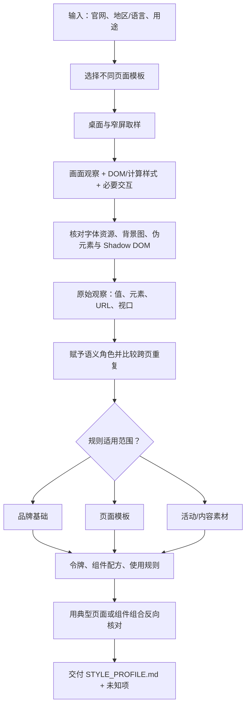
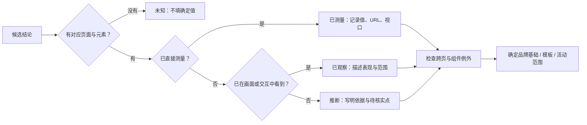

<div align="center">

# Website Style Extractor

### 把品牌官网转化为有证据、可复用的设计规则

从页面画面与实际样式出发，识别专有字体、特征性视觉要素、组件关系和响应式变化；将稳定的品牌语言与页面模板、短期活动素材分开。

[快速开始](#quick-start) · [抽取逻辑](#how-it-works) · [魔兽世界实例](#warcraft-example) · [验证与边界](#validation) · [文件导航](#files) · [MIT 许可](./LICENSE)

</div>

## 这是什么

Website Style Extractor 是一套给 AI 使用的网站风格抽取能力，提供 [Codex Skill](./SKILL.md)、[可移植提示词](./PORTABLE_PROMPT.md) 和[输出约定](./references/output-contract.md)。给它一个品牌官网，它会指导具备浏览能力的 AI 跨页面、跨视口观察，产出带来源、适用范围和不确定性标记的风格说明。

目标产物不是一张色卡，而是一份能回答这些问题的 `STYLE_PROFILE.md`：

- 网站最有辨识度的字体、标志组合、图像和纹理是什么？它们出现在哪些场景？
- 哪些颜色、排版和组件关系跨页面稳定，哪些只属于某个模板或一次活动？
- 如何组合画布、布局、字体、CTA 和主视觉，重建一块具有相同气质的页面？
- 每个具体数值依据哪个页面、哪个视口、哪个元素？还有哪些状态没有检查？

这是一套**由 AI 执行的调查与提炼方法**。仓库目前不包含自动爬虫、浏览器插件或可一键生成设计令牌的程序；使用时需要 AI 或操作者有权访问目标网站，并能查看页面画面与样式。

## 为什么需要这套方法

单看截图很容易得到“这个网站是暖色、圆角、留白多”一类描述，却忽略真正决定品牌识别度的专有字形、标志锁定方式、摄影/插画语汇和组件组合。只读 CSS 也会出错：`background-color` 可能被背景图覆盖，透明层的最终颜色取决于下层内容，Web Components 的样式可能位于 Shadow DOM 中。

本方法把**观察、测量、提炼、验证**分开：先拿到页面证据，再赋予语义角色，确认跨页面是否稳定，最后才写成令牌、组件配方和使用规则。它会保留页面差异，而不会把一个首页样本写成“全站只能如此”。

<a id="quick-start"></a>

## 快速开始

### 方式一：在 Codex 中使用 Skill

克隆仓库，将根目录的 `SKILL.md` 与 `references/` 一起放入你的 Codex skills 目录，目录名保持 `website-style-extractor`。已经安装本 Skill 的环境可以直接使用。随后在聊天中提供官网和目的，例如：

```text
使用 $website-style-extractor 分析 https://example.com 的品牌视觉系统。
重点识别专有字体、标志/插画/纹理等特征性要素。
请覆盖首页、一个内容页和一个详情页，并标明桌面与手机视口的差异。
产出带来源和未知项的 STYLE_PROFILE.md。
```

如果只需要一个页面或特定组件，也可以明确缩小范围。Skill 会根据实际可访问页面调整取样，而不会编造未检查的状态。

### 方式二：在其他 AI 中使用

把 [PORTABLE_PROMPT.md](./PORTABLE_PROMPT.md) 的内容作为任务说明提供给具备网页访问能力的 AI，再补充目标网址、地区/语言和交付用途。若希望不同 AI 产出结构一致，同时提供 [输出约定](./references/output-contract.md)。

```text
目标官网：https://example.com
用途：为新的产品页面建立视觉参考
地区/语言：英文 / 美国
特别关注：品牌字体、特征性设计要素、主次 CTA 和移动端变化
交付：STYLE_PROFILE.md；每条重要结论都写明证据与适用范围
```

AI 需要能够真正打开官网。只有搜索摘要、旧截图或用户提供的现成报告时，产物应标明资料来源及无法现场验证的部分。

## 适合做什么

| 场景 | 产出重点 |
|---|---|
| 新网站的视觉参考 | 识别品牌最有辨识度的排版、图像、色彩与组件组合 |
| 设计系统梳理 | 整理语义颜色、字体层级、间距、形状和组件变体，并标注证据 |
| 多页面风格一致性检查 | 找出全站基础、不同模板与活动皮肤之间的稳定点和例外 |
| 旧版风格报告复核 | 对照当前官网，保留可靠结论，修正过度归纳或已过时的数值 |
| AI 生成页面前的约束输入 | 提供可操作的“最小重建配方”，而不只是形容词和色号 |

它不负责下载或再分发网站的专有字体、商标和图片，也不会自动证明这些素材的授权状态。视觉替代方案只能标为近似，不能冒充原版品牌资产。

<a id="how-it-works"></a>

## 抽取逻辑



### 1. 选样本：找不同模板，不堆同类页面

默认从站内选择首页/活动页、内容列表页、产品或详情页等有不同功能的页面。通常两到三种模板能暴露主要规律；若发现子品牌、地区或主题切换，再扩大范围。对主要模板检查桌面与窄屏的导航、首屏、内容区、CTA、卡片和页脚。

### 2. 先找品牌指纹

优先观察专有字体、Logo/徽记的组合方式、独特字形、摄影或插画主题、纹理、图标和装饰母题。按**独特性、跨页稳定性、重建影响**排序。普通灰阶和常见圆角可以记录，但不应压过真正决定识别度的元素。

字体核对至少区分三层：页面声明的 `font-family`、能确认的字体资源/加载状态、浏览器实际呈现的字形。计算样式出现专有字体名称，只能证明声明；如果未验证字体文件加载，就在结果中写“加载未确认”。

### 3. 再抽取可复用规则

| 要素 | 要回答的问题 | 常见误判 |
|---|---|---|
| 颜色角色 | 哪个颜色用于画布、正文、边框、链接、主次操作和暗色区域？ | 把活动插画中的高饱和色当成 UI 主色 |
| 字体层级 | 标题、正文、导航、标签各用什么家族、字重、字号、行高和字距？ | 把某页大标题尺寸写成全站唯一尺寸 |
| 布局与留白 | 容器、列数、对齐、区块间隔和内容密度如何配合？ | 从两张截图猜出精确断点 |
| 图像与材质 | 图片是内容、装饰，还是按钮/背景的必要组成？ | 只读 `background-color`，漏掉背景图和透明层 |
| 组件配方 | 导航、CTA、卡片、输入和页脚有哪些变体？ | 只看首页，把页面专属样式写成全站规范 |
| 行为与响应式 | 滚动、菜单、悬停、焦点和窄屏重排实际如何变化？ | 未操作就写“固定”“悬停变色”等结论 |

### 4. 给每条结论一个证据等级



最终说明中的关键表格包含**值或表现、适用范围、证据 URL 与元素、状态**。只有在多页重复且角色稳定时，才提升为设计令牌；“只用”“绝不”“全站没有”须有与其范围相称的证据。

## 输出长什么样

默认输出一份 `STYLE_PROFILE.md`，按[输出约定](./references/output-contract.md)组织：

1. 官网与采样范围，包括页面 × 视口矩阵。
2. 一句话设计原则和最有辨识度的字体/视觉特征。
3. 颜色、字体、布局、图像、形状、交互和响应式的证据表。
4. 导航、按钮、链接、卡片等组件的组合配方与页面变体。
5. 不看原站也能执行的最小重建配方。
6. 与参考资料的相符/差异、未检查状态和下一步核实点。

如果下游工具需要 JSON/YAML，可另导出结构化令牌；每个条目仍应保留 `value`、`role`、`scope`、`sourceUrl` 和 `status`。没有证据的推测值不应以确定令牌输出。

<a id="warcraft-example"></a>

## 魔兽世界官网：第三品牌验证实例

完整结果见[魔兽世界风格样本](./examples/world-of-warcraft.md)。这次验证覆盖英文官网[首页](https://worldofwarcraft.blizzard.com/en-us/)与[资讯页](https://worldofwarcraft.blizzard.com/en-us/news)，并核对首页桌面与 390px 窄屏。

| 抽取点 | 现场结果 | 对方法的意义 |
|---|---|---|
| 品牌指纹 | Warcraft 徽记、版本 Logo、幻想世界插画、金色短横线与金色纹理 CTA | 识别度来自组合关系，而非单独一个色号 |
| 稳定骨架 | 深棕近黑底色；首页大标题使用 Montserrat，正文声明 Open Sans | 可以抽为页面基础，但字体角色仍需标注范围 |
| 模板差异 | 资讯页使用图片叠字卡片、密集列表，局部标题声明 `Semplicita Pro` | 不能把首页字体和内容密度推广到所有页面 |
| 活动皮肤 | 首屏紫蓝天空、角色与版本图像随内容变化 | 不纳入稳定 UI 主色 |
| 组件实现 | 金色主按钮叠加 `button-bg-primary.png`；相关样式位于 Web Component/Shadow DOM | 单读普通按钮和底色会漏掉真实外观 |
| 响应式 | 首页标题从桌面约 52px 变为窄屏约 36px，CTA 改为纵向全宽 | 能描述已观察的重排；精确断点仍未知 |

这份样本不打包官网图片或字体。`Semplicita Pro` 是页面中的字体声明，字体文件是否实际加载及其授权状态没有独立确认。

<a id="validation"></a>

## 验证与已知边界

2026-10-01 的[现场核对记录](./validation/2026-10-01.md)使用了 Apple、Anthropic 和魔兽世界三个品牌的六个官网页面，三个首页另做了 390px 窄屏检查。Apple 与 Anthropic 的附件结果作为待检参考，发现过度固定导航、标题字重、CTA 等规则的问题；魔兽世界作为第三品牌，用来检查方法是否会漏掉活动主视觉、图片纹理和 Shadow DOM。

当前验证支持**公开页面的静态视觉分析**以及已检查的窄屏首屏变化。尚未完成的包括全部内页的移动端、精确断点、悬停/键盘焦点、完整动效、登录后区域和字体文件实际加载核验。任何未来抽取都应重新读取目标网站；本仓库的品牌实例是当日快照，不是永久有效的官方设计规范。

<a id="files"></a>

## 文件导航

```text
website-style-extractor/
├── README.md                         项目说明与逻辑图
├── SKILL.md                          Codex Skill 主入口
├── PORTABLE_PROMPT.md                其他 AI 可直接使用的提示词
├── references/
│   └── output-contract.md            交付结构与证据字段
├── examples/
│   └── world-of-warcraft.md           第三品牌验证样本
└── validation/
    └── 2026-10-01.md                 Apple / Anthropic / 魔兽世界核对记录
```

## 常见问题

**没有浏览器开发工具，还能用吗？** 可以做画面级观察，但不能把精确 CSS 值、字体加载、组件内部结构写成“已测量”。交付时说明能力边界和未验证项。

**为什么不直接提取整站所有 CSS 变量？** 变量名和页面视觉角色未必一一对应，也可能包含废弃样式、活动资产和隐藏模板。方法先采样实际可见元素，再提炼跨页稳定的语义规则。

**能保证完全复刻原站吗？** 本能力提供证据化风格说明，不提供原站素材授权或像素级复刻保证。页面内容、地区、登录状态和活动版本都会影响结果。

**可以用于其他 AI 吗？** 可以。使用 [PORTABLE_PROMPT.md](./PORTABLE_PROMPT.md)，并把[输出约定](./references/output-contract.md)一同提供。不同 AI 的浏览与样式检查能力不同，缺失的验证应如实标注。

## 反馈与改进

发现新类型的网站结构或误判时，提供目标 URL、页面/视口、原结论和相反证据。优先修正能改变抽取决策的规则，避免为单站堆叠大量例外。新增样本应与通用方法分开存放，并标注访问日期。

## 许可

本仓库原创内容按 [MIT License](./LICENSE) 授权。文中提及的第三方商标、网站图片和专有字体仍归其权利人所有；本仓库未打包这些素材，也不授予其使用权。
